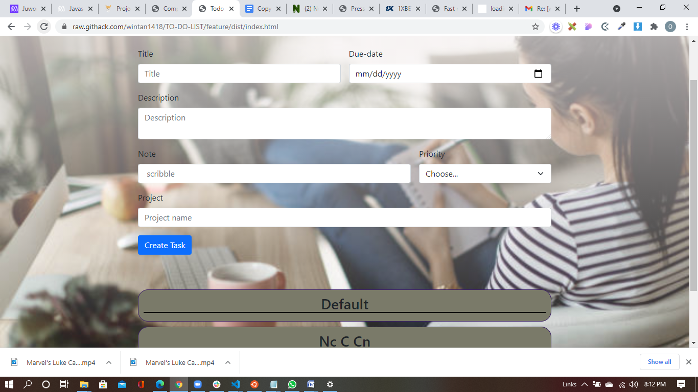

# Todo List

This project entails you building an app that allows you to

- Create new tasks 
- Show the present tasks in the todo list app
- Show different projects(categories)
- Modify and delete tasks.

### Live Demo

[Live Demo Link](https://raw.githack.com/wintan1418/TO-DO-LIST/feature/dist/index.html)

## Built With

- HTML/CSS
- Javascript
- Bootstrap
- font awesome
- webpack
- VS Code

## Getting Started

- Clone the repository
- Navigate to the root directory of the project
- Open index.html or run it using your own live server

👤 Author

Oluwadare Juwon

- Github: [@Oluwadare Juwon](https://github.com/wintan1418)
- Linkedin: (www.linkedin.com/in/oluwintan)
- Twitter: [Oluwadare-juwon](https://twitter.com/@oluwadarejuwon)

## 🙋‍♂ show your support

give a ⭐️ if you like this project!

## 📝 license

This project is [MIT](LICENSE) licensed.
